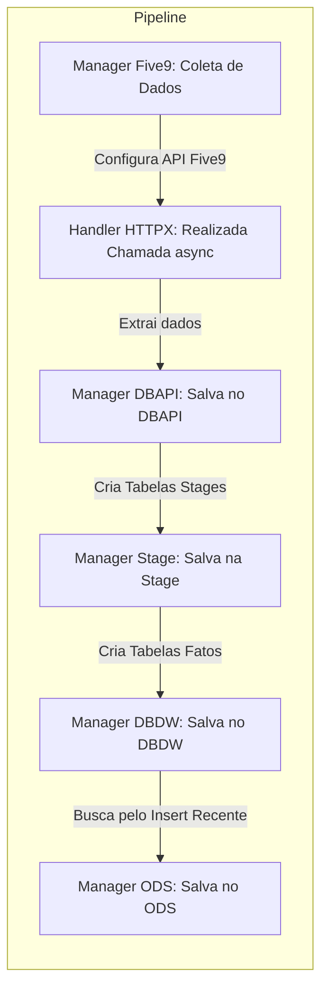

# Pipeline de Dados - Five9

## Descrição

Este repositório contém o pipeline de dados criado para busca de dados na plataforma Five9 (central de atendimento ao cliente da Alloha Fibra). O projeto teve como principal ofensor a realização da busca de reports na Five9 através de APIs fornececida pela própria e a carga desses dados em nossos bancos de dados internos. Para isso no entanto, foi preciso o desenvolvimento de um código python que fizesse tanto a busca dos dados quanto a carga.

### Fluxo do ETL



## Começando

### Pré-requisitos

- **VSCode**: É o editor de código utilizado para desenvolver o ETL. [Instruções de instalação do VSCode aqui](https://code.visualstudio.com/download). Nesse caso, se trata apenas de um editor de texto, fique a vontade para utilizar outro que esteja mais familiarizado tal como o PyCharm. [Instruções de instalação do PyCharm aqui](https://www.jetbrains.com/pt-br/pycharm/download/?section=windows).

- **Git e GitLab**:

    - Você deve ter o Git instalado em sua máquina. [Instruções de instalação do Git aqui](https://git-scm.com/book/pt-br/v2).
    - Você também deve ter uma conta no GitLab da Sumicity (Alloha Fibra). Solicitar a credencial pessoal ao time de TI. [Acesso ao GitLab apenas com VPN](http://git.sumicity.net.br/).
    - Se você for usuário Windows, recomendo esse vídeo: [Youtube](https://www.youtube.com/watch?v=_hZf1teRFNg).
    - Tutorial de Git e GitLab básico [Ebook](https://www.linkedin.com/posts/lucianovasconcelosf_domine-seus-projetos-de-dados-9-comandos-activity-7093915148351864832-mYpp?utm_source=share&utm_medium=member_desktop).
    - Se você já é usuário Git, recomendo o vídeo do Akita: [Youtube](https://www.youtube.com/watch?v=6Czd1Yetaac).

- **Pyenv**: É usado para gerenciar versões do Python. [Instruções de instalação do Pyenv aqui](https://github.com/pyenv/pyenv#installation). Vamos usar nesse projeto o Python 3.11.5. Para usuários Windows, é recomendado assistirem esse tutorial [Youtube](https://www.youtube.com/watch?v=TkcqjLu1dgA).

- **Poetry**: Este projeto utiliza Poetry para gerenciamento de dependências. [Instruções de instalação do Poetry aqui](https://python-poetry.org/docs/#installing-with-the-official-installer).Se você é usuário Windows, recomendo assistir esse vídeo: [Youtube](https://www.youtube.com/watch?v=BuepZYn1xT8). Que instala o Python, Poetry e VSCode. Mas um simples comando *pip install poetry* já resolve.

### Instalação e Configuração
1. Clone o repositório:

```
git clone http://git.sumicity.net.br/matheus.costa/five9.git
cd five9
```

2. Configure a versão correta do Python com pyenv:

```
pyenv install 3.11.5
pyenv local 3.11.5
```

3. Comando para que a pasta .venv fique dentro do projeto:

```
poetry config virtualenvs.in-project true
```

4. Instale as dependências do projeto:

```
poetry install --only main (Instalar apenas de Produção)
poetry install (Instalar todas dependências)
```

5. Ative o ambiente virtual com bash:

```
source .venv/Scripts/activate (Windows)
source .venv/bin/activate (Linux)
```

6. Execute o comando para ver a documentação do projeto:

```
task doc
```

7. Execute o comando de execução da pipeline para realizar a ETL:

```
task run_chat (Pipeline Chamadas Chat) OU
task run_voz (Pipeline Chamadas Voz)
```

8. Verifique na pasta logs se o a ETL rodou corretamente.
