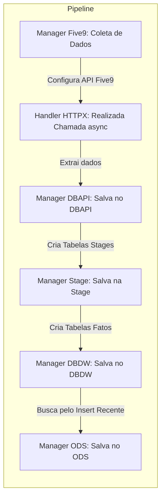

# Documentação do Pipeline de Dados Five9

## Descrição

O projeto teve como principal ofensor a realização da busca de reports na Five9 através de APIs fornececida pela própria e a carga desses dados em nossos bancos de dados internos. Para isso no entanto, foi preciso o desenvolvimento de um código python que fizesse tanto a busca dos dados quanto a carga.

### Fluxo do ETL

